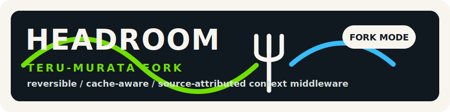

<p align="center">
  
</p>

<p align="center"><strong>reversible · cache-aware · provenance-focused · coding-agent context middleware</strong></p>

<p align="center">
  <a href="https://github.com/teru-murata/headroom/actions/workflows/ci.yml"></a>
  <a href="https://github.com/teru-murata/headroom/issues"></a>
  <a href="https://github.com/chopratejas/headroom"></a>
  <a href="https://pypi.org/project/headroom-ai/"></a>
  <a href="https://www.npmjs.com/package/headroom-ai"></a>
  <a href="https://huggingface.co/chopratejas/kompress-base"></a>
  <a href="https://headroomlabs.ai/dashboard"></a>
  <a href="LICENSE"></a>
  <a href="https://headroom-docs.vercel.app/docs"></a>
</p>

<p align="center">
  <a href="#about-this-fork">This fork</a> ·
  <a href="#roadmap-and-tracking">Roadmap</a> ·
  <a href="https://headroom-docs.vercel.app/docs">Upstream docs</a> ·
  <a href="#get-started-60-seconds">Install</a> ·
  <a href="#claim-audit-matrix">Claims</a> ·
  <a href="#agent-compatibility-matrix">Agents</a> ·
  <a href="https://discord.gg/yRmaUNpsPJ">Discord</a> ·
  <a href="llms.txt">llms.txt</a>
</p>

<p align="center"><sub>
  <b>AI agents / LLMs:</b> read <a href="llms.txt"><code>/llms.txt</code></a> here, or fetch <a href="https://headroom-docs.vercel.app/llms.txt">the live index</a> / <a href="https://headroom-docs.vercel.app/llms-full.txt">full docs blob</a>.
</sub></p>

---

## About this fork

This repository is the `teru-murata/headroom` fork of [`chopratejas/headroom`](https://github.com/chopratejas/headroom). Upstream provides the package, runtime, proxy, MCP server, and compression pipeline this fork builds on. This fork keeps that base, but takes ownership of a narrower product direction:

> reversible, cache-aware, source-attributed context middleware for AI coding agents.

The fork policy is simple:

- keep shipped behavior honest in the README;
- keep ambitious ideas visible as roadmap Issues instead of marketing claims;
- focus on coding-agent context waste: tool outputs, logs, search results, file trees, diffs, schemas, RAG chunks, MCP results, and prior context;
- treat sandbox/code-execution systems as complementary inputs, not enemies;
- make reversibility, provider cacheability, and token provenance first-class design constraints.

Fork-specific roadmap and claim tracking live in [Issues](https://github.com/teru-murata/headroom/issues). Upstream documentation remains useful for installation and existing APIs, but this README describes the direction of this fork.

> Headroom is a reversible, cache-aware context compression layer for AI coding agents. It focuses on high-noise surrounding context — tool outputs, logs, search results, file trees, diffs, schemas, RAG chunks, MCP results, and structured payloads — while preserving exact retrieval of omitted originals where CCR is available.

<p align="center">
  
  <br/><sub>Live: 10,144 → 1,260 tokens — same FATAL found.</sub>
</p>

## Positioning

Headroom is not trying to win on compression ratio alone. Sandbox-style tools keep raw output out of context; prompt compressors shorten natural-language prompts; observability tools count request-level spend. Headroom's fork direction is different: make noisy coding-agent context reversible, cache-aware, and attributable at the source level.

Sandbox-style systems are important, but they solve a different layer of the problem. Progressive disclosure reduces static tool-definition bloat. Code execution keeps intermediate tool results inside a sandbox and returns only selected summaries. Those approaches can produce excellent headline reductions, but they require a secure execution environment, depend on the model writing correct orchestration code, and do not by themselves provide a CCR-style ledger that ties omitted originals, context markers, retrievals, cache zones, and token spend together.

Headroom's position is therefore:

| Approach | Best at | Tradeoff | Headroom stance |
|---|---|---|---|
| Progressive disclosure | Reducing static tool-definition bloat | The model still needs the right tool/API at the right time. | Complementary. Track tool-schema cost and compress downstream outputs. |
| Code execution / sandbox mode | Keeping intermediate tool data out of model context | Requires sandbox infrastructure and strong code-generation behavior. | Complementary. Import sandbox summaries/artifacts into the provenance ledger. |
| Prompt compression | Shortening natural-language prompts | Often lossy and not specialized for coding-agent tool output. | Adjacent. Prefer structure-aware compression for logs, diffs, schemas, and results. |
| Request observability | Counting model calls, latency, and cost | Usually request-level, not source-level. | Integrate. Add source-level compression and retrieval provenance. |
| Headroom | Managing noisy context that does enter, or already entered, the agent workflow | Needs careful cache and retrieval guarantees. | Reversible, cache-aware, source-attributed context middleware. |

The goal is not to replace sandbox systems. A stronger direction is to accept sandbox output as an input: record what stayed out of context, what summary entered context, what can still be retrieved, and what Headroom compressed afterward.

The current README is intentionally split between shipped behavior and roadmap items. Unshipped ideas are not hidden; they are tracked as Issues so they can be implemented, measured, or rejected explicitly.

## What ships today

| Feature | Status | Notes |
|---|---|---|
| Python / TypeScript compression library | Shipped | `compress(messages)` can be used inline in apps. |
| Local proxy | Shipped | `headroom proxy --port 8787`; local developer mode is the default. |
| Agent wrap | Shipped / integration-specific | `headroom wrap claude|codex|cursor|aider|copilot`; provider behavior varies. |
| MCP server | Shipped | `headroom_compress`, `headroom_retrieve`, `headroom_stats`. |
| Structured/tool-output compression | Shipped / under audit | Best fit: logs, JSON, RAG chunks, file reads, search results, tool outputs. |
| CacheAligner | Shipped as detector-only | Detects volatile prefix content and reports cache-stability metrics; it does not rewrite prompts. |
| CCR retrieval | Experimental | Originals are cached locally and retrievable while the cache entry is available. Durable guarantees are tracked below. |

## Roadmap and tracking

| Area | Why it matters | Tracking |
|---|---|---|
| CCR endpoint safety | Retrieve endpoints return original content and need clear local/remote boundaries. | [#1](https://github.com/teru-murata/headroom/issues/1), [#10](https://github.com/teru-murata/headroom/issues/10), [#18](https://github.com/teru-murata/headroom/issues/18) |
| CCR marker contract | Reversibility needs a versioned marker and retrieval contract. | [#4](https://github.com/teru-murata/headroom/issues/4), [#13](https://github.com/teru-murata/headroom/issues/13) |
| Durable CCR backends | "Reversible" is only strong when storage guarantees are explicit. | [#3](https://github.com/teru-murata/headroom/issues/3), [#8](https://github.com/teru-murata/headroom/issues/8) |
| Cache-coherent compression | Compression should not destroy provider prefix-cache savings. | [#2](https://github.com/teru-murata/headroom/issues/2), [#6](https://github.com/teru-murata/headroom/issues/6), [#15](https://github.com/teru-murata/headroom/issues/15) |
| Coding-agent presets | Test logs, build logs, search results, file trees, diffs, and schemas need structure-aware rules. | [#9](https://github.com/teru-murata/headroom/issues/9), [#16](https://github.com/teru-murata/headroom/issues/16), [#17](https://github.com/teru-murata/headroom/issues/17) |
| Token provenance ledger | Users should see which source burned tokens, how it was compressed, and whether it was retrieved. | [#5](https://github.com/teru-murata/headroom/issues/5), [#19](https://github.com/teru-murata/headroom/issues/19), [#20](https://github.com/teru-murata/headroom/issues/20) |
| Context waste benchmark | Claims should be measured on shared coding-agent traces. | [#11](https://github.com/teru-murata/headroom/issues/11), [#14](https://github.com/teru-murata/headroom/issues/14) |
| Sandbox provenance bridge | Sandbox systems can keep data out of context; Headroom should attribute what stayed out, what entered, and what remains retrievable. | [#21](https://github.com/teru-murata/headroom/issues/21) |
| Reversible conversation compaction | Conversation-history compaction should be opt-in, cache-aware, and retrievable. | [#7](https://github.com/teru-murata/headroom/issues/7) |
| Multimodal / realtime | Voice, image, and video compression need separate latency and fidelity criteria. | [#12](https://github.com/teru-murata/headroom/issues/12) |

## Claim audit matrix

| Claim | Current status | Limitation | Tracking |
|---|---|---|---|
| Compresses noisy tool/context outputs | Shipped / under audit | Coverage depends on provider and integration path. | [#11](https://github.com/teru-murata/headroom/issues/11), [#14](https://github.com/teru-murata/headroom/issues/14) |
| CCR makes compression reversible | Experimental | Default storage is local cache with TTL; durable backends are roadmap. | [#3](https://github.com/teru-murata/headroom/issues/3), [#8](https://github.com/teru-murata/headroom/issues/8), [#13](https://github.com/teru-murata/headroom/issues/13) |
| CacheAligner improves provider cache hits | Under audit | Current implementation is detector-only; net cache savings need measurement. | [#2](https://github.com/teru-murata/headroom/issues/2), [#6](https://github.com/teru-murata/headroom/issues/6), [#15](https://github.com/teru-murata/headroom/issues/15) |
| Conversation history is compressed | Roadmap | Codex/OpenAI Responses protects user/system/assistant prefix content by design. | [#7](https://github.com/teru-murata/headroom/issues/7) |
| Public proxy deployment is safe by default | Roadmap / safety work | Local mode is default; remote mode needs auth, namespace, and retrieve policy. | [#1](https://github.com/teru-murata/headroom/issues/1), [#10](https://github.com/teru-murata/headroom/issues/10), [#18](https://github.com/teru-murata/headroom/issues/18) |
| 60–95% fewer tokens | Benchmark claim | Keep headline numbers tied to reproducible traces, task accuracy, cache impact, and retrieve rate. | [#11](https://github.com/teru-murata/headroom/issues/11), [#14](https://github.com/teru-murata/headroom/issues/14) |

## How it works (30 seconds)

```
 Your agent / app
   (Claude Code, Cursor, Codex, LangChain, Agno, Strands, your own code…)
        │   prompts · tool outputs · logs · RAG results · files
        ▼
    ┌────────────────────────────────────────────────────┐
    │  Headroom   (runs locally — your data stays here)  │
    │  ────────────────────────────────────────────────  │
    │  CacheAligner  →  ContentRouter  →  CCR            │
    │                    ├─ SmartCrusher   (JSON)        │
    │                    ├─ CodeCompressor (AST)         │
    │                    └─ Kompress-base  (text, HF)    │
    │                                                    │
    │  Cross-agent memory  ·  headroom learn  ·  MCP     │
    └────────────────────────────────────────────────────┘
        │   compressed prompt  +  retrieval tool
        ▼
 LLM provider  (Anthropic · OpenAI · Bedrock · …)
```

- **ContentRouter** — detects content type, selects the right compressor
- **SmartCrusher / CodeCompressor / Kompress-base** — compress JSON, AST, or prose
- **CacheAligner** — detects volatile prefix content and reports cache-stability metrics
- **CCR** — caches originals locally; LLM calls `headroom_retrieve` if it needs them while the entry is available

Provider-specific behavior is conservative where cache stability matters. For example, Codex/OpenAI Responses compression focuses on live tool-output slots and protects user, system, and assistant prefix content from mutation.

→ [Architecture](https://headroom-docs.vercel.app/docs/architecture) · [CCR reversible compression](https://headroom-docs.vercel.app/docs/ccr) · [Kompress-base model card](https://huggingface.co/chopratejas/kompress-base)

## Get started (60 seconds)

```bash
# 1 — Install
pip install "headroom-ai[all]"          # Python
npm install headroom-ai                 # Node / TypeScript

# 2 — Pick your mode
headroom wrap claude                    # wrap a coding agent
headroom proxy --port 8787              # drop-in proxy, zero code changes
# or: from headroom import compress      # inline library

# 3 — See the savings
headroom stats
```

Granular extras: `[proxy]`, `[mcp]`, `[ml]`, `[agno]`, `[langchain]`, `[evals]`. Requires **Python 3.10+**.

## Proof

**Savings on real agent workloads:**

| Workload                      | Before | After  | Savings |
|-------------------------------|-------:|-------:|--------:|
| Code search (100 results)     | 17,765 |  1,408 | **92%** |
| SRE incident debugging        | 65,694 |  5,118 | **92%** |
| GitHub issue triage           | 54,174 | 14,761 | **73%** |
| Codebase exploration          | 78,502 | 41,254 | **47%** |

**Accuracy preserved on standard benchmarks:**

| Benchmark  | Category | N   | Baseline | Headroom | Delta      |
|------------|----------|----:|---------:|---------:|------------|
| GSM8K      | Math     | 100 |    0.870 |    0.870 | **±0.000** |
| TruthfulQA | Factual  | 100 |    0.530 |    0.560 | **+0.030** |
| SQuAD v2   | QA       | 100 |        — |  **97%** | 19% compression |
| BFCL       | Tools    | 100 |        — |  **97%** | 32% compression |

Reproduce: `python -m headroom.evals suite --tier 1` · [Full benchmarks & methodology](https://headroom-docs.vercel.app/docs/benchmarks)

<p align="center">
  <a href="https://headroomlabs.ai/dashboard">
    
  </a>
  <br/><b><a href="https://headroomlabs.ai/dashboard">60B+ tokens saved by the community — live leaderboard →</a></b>
</p>

## Agent compatibility matrix

| Agent       | `headroom wrap` | Notes                            |
|-------------|:---------------:|----------------------------------|
| Claude Code | ●               | `--memory` · `--code-graph`      |
| Codex       | ●               | shares memory with Claude        |
| Cursor      | ●               | prints config — paste once       |
| Aider       | ●               | starts proxy + launches          |
| Copilot CLI | ●               | starts proxy + launches          |
| OpenClaw    | ●               | installs as ContextEngine plugin |

Any OpenAI-compatible client works via `headroom proxy`. MCP-native: `headroom mcp install`.

## When to use · When to skip

**Great fit if you…**
- run AI coding agents daily and want savings without changing your code
- work across multiple agents and want shared memory
- need reversible compression — originals can be retrieved via CCR while the local cache entry is available

**Skip it if you…**
- only use a single provider's native compaction and don't need cross-agent memory
- work in a sandboxed environment where local processes can't run

<details>
<summary><b>Integrations — drop Headroom into any stack</b></summary>

| Your setup             | Hook in with                                                     |
|------------------------|------------------------------------------------------------------|
| Any Python app         | `compress(messages, model=…)`                                    |
| Any TypeScript app     | `await compress(messages, { model })`                            |
| Anthropic / OpenAI SDK | `withHeadroom(new Anthropic())` · `withHeadroom(new OpenAI())`   |
| Vercel AI SDK          | `wrapLanguageModel({ model, middleware: headroomMiddleware() })` |
| LiteLLM                | `litellm.callbacks = [HeadroomCallback()]`                       |
| LangChain              | `HeadroomChatModel(your_llm)`                                    |
| Agno                   | `HeadroomAgnoModel(your_model)`                                  |
| Strands                | [Strands guide](https://headroom-docs.vercel.app/docs/strands)  |
| ASGI apps              | `app.add_middleware(CompressionMiddleware)`                      |
| Multi-agent            | `SharedContext().put / .get`                                     |
| MCP clients            | `headroom mcp install`                                           |

</details>

<details>
<summary><b>What's inside</b></summary>

- **SmartCrusher** — universal JSON: arrays of dicts, nested objects, mixed types.
- **CodeCompressor** — AST-aware for Python, JS, Go, Rust, Java, C++.
- **Kompress-base** — our HuggingFace model, trained on agentic traces.
- **Image compression** — 40–90% reduction via trained ML router.
- **CacheAligner** — detects volatile prefix content and reports cache-stability metrics without rewriting prompts.
- **IntelligentContext** — score-based context fitting with learned importance.
- **CCR** — reversible retrieval for cached originals; durable guarantees are tracked in the roadmap.
- **Cross-agent memory** — shared store, agent provenance, auto-dedup.
- **SharedContext** — compressed context passing across multi-agent workflows.
- **`headroom learn`** — plugin-based failure mining for Claude, Codex, Gemini.

</details>

<details>
<summary><b>Pipeline internals</b></summary>

Headroom exposes one stable request lifecycle across `compress()`, the SDK, and the proxy:

`Setup` → `Pre-Start` → `Post-Start` → `Input Received` → `Input Cached` → `Input Routed` → `Input Compressed` → `Input Remembered` → `Pre-Send` → `Post-Send` → `Response Received`

- **Transforms** do the work: CacheAligner, ContentRouter, SmartCrusher, CodeCompressor, Kompress-base, IntelligentContext / RollingWindow.
- **Pipeline extensions** observe or customize lifecycle stages via `on_pipeline_event(...)`.
- **Compression hooks** sit alongside the canonical lifecycle as an additional extension seam.
- **Proxy extensions** remain the server/app integration seam for ASGI middleware, routes, and startup policy.

Provider and tool-specific behavior lives under `headroom/providers/` so core orchestration stays focused on lifecycle, sequencing, and policy.

- **CLI/tool slices**: `headroom/providers/claude`, `copilot`, `codex`, `openclaw`
- **Provider runtime slices**: `headroom/providers/claude`, `gemini`, plus shared backend/runtime dispatch in `headroom/providers/registry.py`
- **Core files stay orchestration-first**: `wrap.py`, `client.py`, `cli/proxy.py`, and `proxy/server.py` delegate provider-specific env shaping, API target normalization, backend selection, and transport dispatch.

</details>

## Install

```bash
pip install "headroom-ai[all]"          # Python, everything
npm install headroom-ai                 # TypeScript / Node
docker pull ghcr.io/chopratejas/headroom:latest
```

Granular extras: `[proxy]`, `[mcp]`, `[ml]` (Kompress-base), `[agno]`, `[langchain]`, `[evals]`. Requires **Python 3.10+**.

Using `pipx`? Choose a supported interpreter explicitly:

```bash
pipx install --python python3.13 "headroom-ai[all]"
```

→ [Installation guide](https://headroom-docs.vercel.app/docs/installation) — Docker tags, persistent service, PowerShell, devcontainers.

## headroom learn

<p align="center">
  
</p>

`headroom learn` — mines failed sessions, writes corrections to `CLAUDE.md` / `AGENTS.md` / `GEMINI.md`.

## Documentation

The links below point to upstream documentation for the current package and runtime. Fork-specific positioning, roadmap, and claim status are tracked in this README and in [`teru-murata/headroom` Issues](https://github.com/teru-murata/headroom/issues).

| Start here                                                                    | Go deeper                                                                          |
|-------------------------------------------------------------------------------|------------------------------------------------------------------------------------|
| [Quickstart](https://headroom-docs.vercel.app/docs/quickstart)                | [Architecture](https://headroom-docs.vercel.app/docs/architecture)                 |
| [Proxy](https://headroom-docs.vercel.app/docs/proxy)                          | [How compression works](https://headroom-docs.vercel.app/docs/how-compression-works) |
| [MCP tools](https://headroom-docs.vercel.app/docs/mcp)                        | [CCR — reversible compression](https://headroom-docs.vercel.app/docs/ccr)          |
| [Memory](https://headroom-docs.vercel.app/docs/memory)                        | [Cache optimization](https://headroom-docs.vercel.app/docs/cache-optimization)     |
| [Failure learning](https://headroom-docs.vercel.app/docs/failure-learning)    | [Benchmarks](https://headroom-docs.vercel.app/docs/benchmarks)                    |
| [Configuration](https://headroom-docs.vercel.app/docs/configuration)          | [Limitations](https://headroom-docs.vercel.app/docs/limitations)                  |

## Compared to

Headroom runs **locally**, targets high-noise context across major agent workflows, works with every major framework, and supports **reversible** retrieval for cached originals.

|                                                                              | Scope                                          | Deploy                             | Local | Reversible |
|------------------------------------------------------------------------------|------------------------------------------------|------------------------------------|:-----:|:----------:|
| **Headroom**                                                                 | Tool outputs, RAG, logs, file reads, structured payloads | Proxy · library · middleware · MCP | Yes   | Yes        |
| [RTK](https://github.com/rtk-ai/rtk)                                        | CLI command outputs                            | CLI wrapper                        | Yes   | No         |
| [lean-ctx](https://github.com/yvgude/lean-ctx)                               | CLI commands, MCP tools, editor rules          | CLI wrapper · MCP                  | Yes   | No         |
| [Compresr](https://compresr.ai), [Token Co.](https://thetokencompany.ai)    | Text sent to their API                         | Hosted API call                    | No    | No         |
| OpenAI Compaction                                                            | Conversation history                           | Provider-native                    | No    | No         |

> **Attribution.** Headroom ships with the excellent [RTK](https://github.com/rtk-ai/rtk) binary for shell-output rewriting — `git show --short`, scoped `ls`, summarized installers. Huge thanks to the RTK team; their tool is a first-class part of our stack, and Headroom compresses supported high-noise context downstream of it. Headroom can also use [lean-ctx](https://github.com/yvgude/lean-ctx) as the selected CLI context tool; set `HEADROOM_CONTEXT_TOOL=lean-ctx` before running `headroom wrap ...`.

## Contributing

```bash
git clone https://github.com/teru-murata/headroom.git && cd headroom
pip install -e ".[dev]" && pytest
```

Fork roadmap discussions happen in [Issues](https://github.com/teru-murata/headroom/issues). Devcontainers live in `.devcontainer/` (default + `memory-stack` with Qdrant & Neo4j). See [CONTRIBUTING.md](CONTRIBUTING.md). For upstream-first contributions, use [`chopratejas/headroom`](https://github.com/chopratejas/headroom).

## Community

- **[Live leaderboard](https://headroomlabs.ai/dashboard)** — 60B+ tokens saved and counting.
- **[Discord](https://discord.gg/yRmaUNpsPJ)** — questions, feedback, war stories.
- **[Kompress-base on HuggingFace](https://huggingface.co/chopratejas/kompress-base)** — the model behind our text compression.

## License

Apache 2.0 — see [LICENSE](LICENSE).
